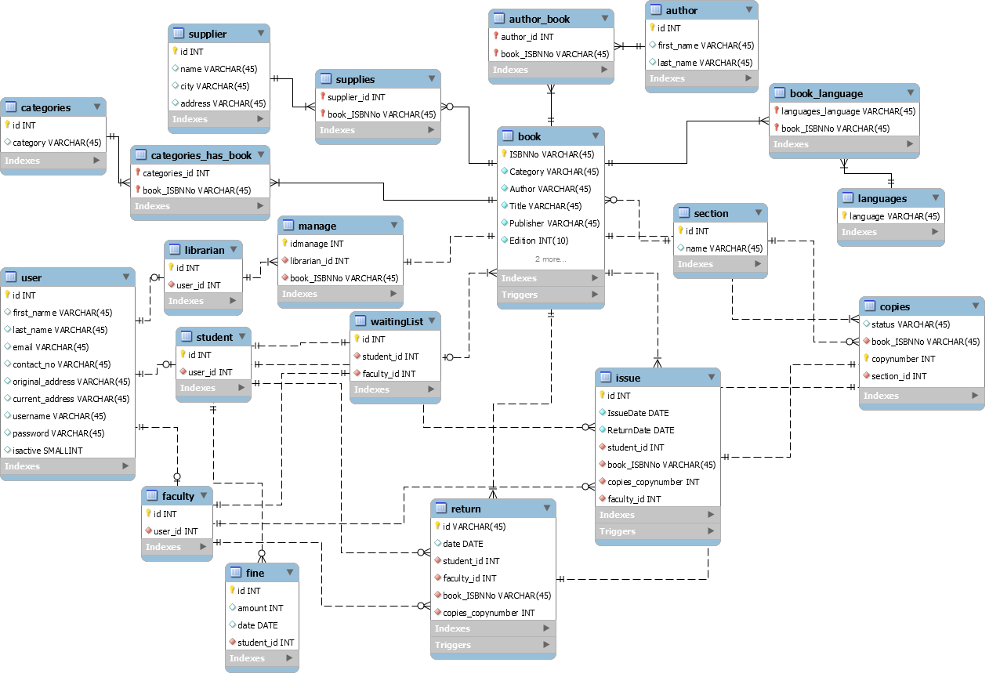
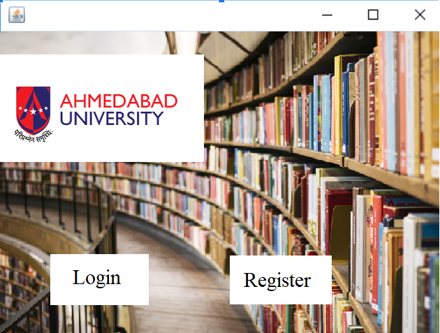

# AU LMS(Library Management System)

CSC300 Software Engineering Project

## Stakeholders identified for the system:

* **Students**
* **Faculty**
* **Director of Library**
* **Admin**
* **Head Librarian**
* **Library Staff**
* **Dean of the University**
* **Management Team**
* **Design / Programming Team**

## ER Diagram

## Login Screen Raw Output

Note: The source code files have not been provided in the repository as per the rules of the Ahmedabad University.
